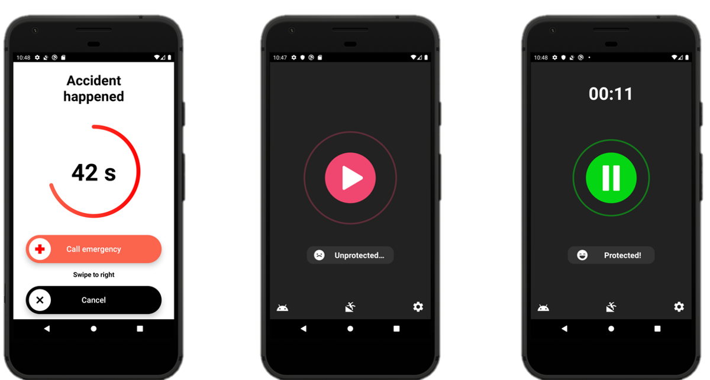
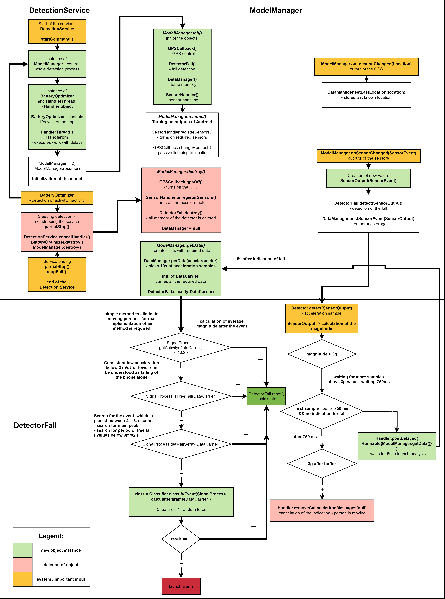
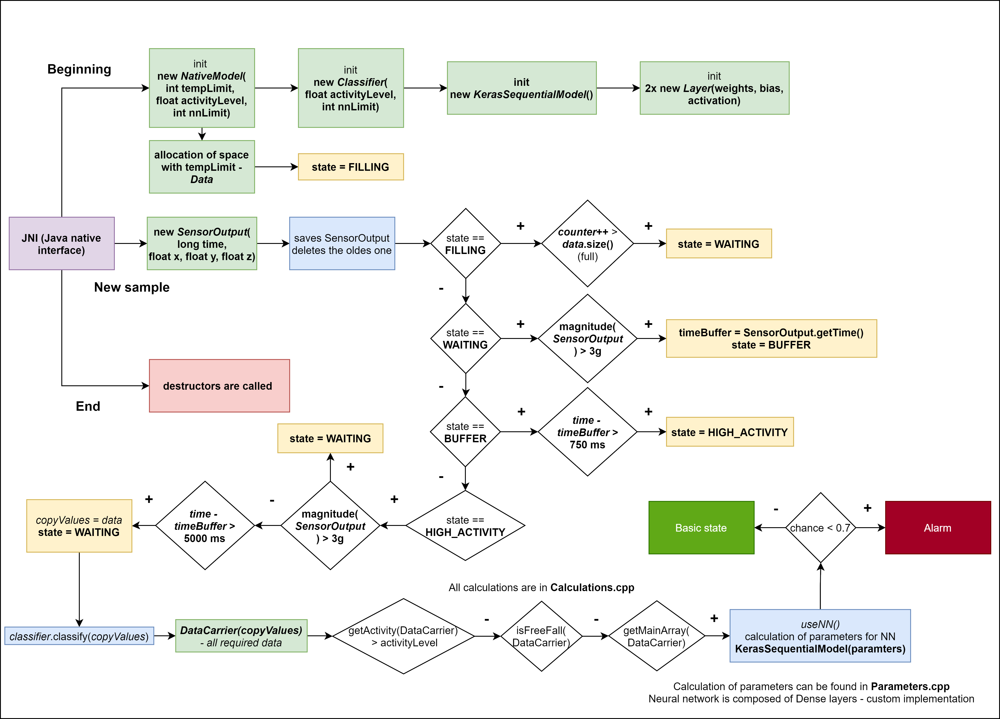
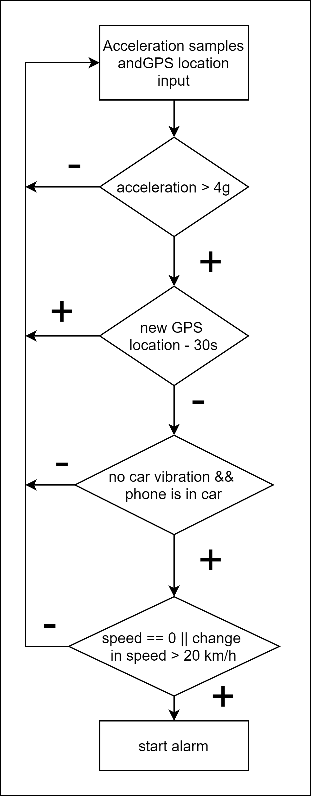

# **BeSafeBox - fall detection Android app** 

[](https://android-arsenal.com/api?level=19) [](https://www.gnu.org/licenses/gpl-3.0)



BeSafeBox is a fall detection Android application. With one button, you can start a background service, which will track your activity - accelerometer data. If you collapse / fall down on a ground, the model will detect an impact and inactivity afterwards. If the fall is recognized, the alarm is triggered. It will try to attract attention from surrounding in hope, that someone will notice you that you need help probably. You can use the unlocked screen to call help for yourself or dismiss the alarm. First responder can also use your phone to contact emergency services, because it will override lock of the screen and show the emergency button to a dialer. If no one is responding to alarm, the app sends SMS and mail after 60s to emergency contact with coordinates and formatted Google map link to your location from GPS. For higher reliability, the phone should be placed in pocket of trousers. The app is easy to use, it is only one button to click. :older_woman::older_man:

## About implementation 

BeSafeBox uses picked math features calculated from acceleration of the impact event. These features are then passed to the machine learning model, which will decide about the event. The model was trained on the 3260 simulated events by real people, which resemble the fall of the person like sitting, laying down or walking or is the actual fall of the person. **The model reached accuracy of 90.5%, with precision is 78% and recall 90,5% in average for the falls alone.** The app was tested also on the real life data with length of 300h (no fall occurred), when from 4000 indications for the fall, only 1.53% triggered false alarm. You have to take into account, that these data were gather by young people, who led active life and went to gym and other physical activities, where the resemblance to fall can be high. 

**We measured additional 104 falls independently to main dataset and 93 / 104 (89,42%) were correctly classified.** :white_check_mark:

**This is purely about Android app implementations, so for more information, numbers, related work and about research on this topic, go to the separate repository:**  

## **[BeSafeBox - research](https://github.com/Foxpace/BeSafeBox_research)** - **open Jupyter notebook Research.ipynb**  :blue_book:

## About technical implementation 

These project has 2 iterations, when the approach to fall detection was changed from feedforward neural network to random forest with simpler features. This resulted in higher accuracy, when we managed to get **from 86% to 90.5%**. Whole project is programmed mainly in **Java, but some parts are in Kotlin and C++.** 

### Java implementation - main objects​ 

Whole detection is made under background service **DetectionService**, which is completely independent from the main activity (no binding between them). There are 2 main objects, **BatteryOptimizer** and **ModelManager**.

**BatteryOptimizer** controls life cycle of the ModelManager. The app is active while the phone is placed in pocket - controls value of proximity sensor. If the sensor has 0 proximity, the detector is active. If the value is higher, the model goes to sleep. Also it monitors state of the battery, so the detection is turned off, when the battery is low. Also it can monitor activity with Activity recognition API in Android / screen activity. If the person is actively moving, the detector is active, but if he stops, the detector stops too. Unfortunately, this API comes with a lot of drawbacks, because of battery restrictions. Read about it later in the text.

**ModelManager** controls all the technical aspects required for the detector. It consists of temporary storage for sensor samples, sensor manager, GPS handler and creates instances of the detector by requirement. There is only one used, but the implementation can be easily expanded to consist multiple detectors. 

**DetectorFall** has method to process all the sensor samples and ask for the storage, when it is needed from ModelManager. It has access to machine learning model and other methods to calculate all the features by requirement. 

Java implementation has iteration of the detector with neural network and also with random forest.

### Fall algorithm implementation  :deciduous_tree:

1. waits for the first sample with magnitude higher than 3g
2. waits for 750ms to pass - the impact is occurring - BUFFER
3. if another 3g value appears, the indication is restarted
4. if no 3g value appears for next 5s, the last 10s are passed for next evaluation
5. if the average activity (mean value) after the main event (ends with last value of 1.5g) is below 10.25 m/s2, the indication is passed to machine leaning model 
6. if the signal consists values below 2 m/s2, it is high chance, that phone is falling freely on the ground (not user) - this condition is omitted if the user uses "active in pocket" option
7. calculation of features --> decision of the model --> triggers alarm or the detector is restarted for next events

### Diagram of the implementation 

### 


### C++ implementation - main objects  🧠

C++ implementation consists only neural network implementation and the temporary storage, other aspects are still controlled by BatteryOptimizer and ModelManager. Prior to creation of simpler model with random forest, the simple Tensorflow neural network with feedforward layers was created with accuracy of 86%. It was created due to easy implementation back then and high performance. The weights and biases were extracted from Python objects to raw C++ vectors. Whole calculation of the neural network was also implemented with objects, which can create network of any depth, if the parameters are provided. 

Due to the Android architecture, the C++ implementation has structure of state model, when the detector goes from the one state to the another in dependence to the behavior of the acceleration signal. Otherwise, the concept remained the same like in the Java implementation. The samples and other commands are provided through JNI (Java native interface). 

**States:**

1. **FILLING** - not enough samples to process event
2. **WAITING** - waits for the 3g value
3. **BUFFER** - saving another samples - occurring impact
4. **HIGH_ACTIVITY** - waits for 5s. If another 3g value comes, goes to the WAITING again
5. otherwise -> analyze signal like in the java implementation   



## Car accident detection :car:

Part of the bachelor work was not only the fall detection, but detection car collision also. It is impossible to record complete range of the acceleration, which occurs during car crash. Phone has range of 8g, but during car crash, the phone can go through dozens of gs. The algorithm has to take from other perspective. The proposed algorithm has multiple conditions, which does not take into account high accelerations. 

1. Phone is not used during the car driving like during daily life -> waiting for the acceleration higher than 4g - hard to achieve with normal use
2. waiting for the new regular GPS income in specific time interval
3. if car accident occurred, it would result in stopping the car
   1. this can be detected with change of speed with difference of 20km/h and higher
   2. during the drive, car vibrates in some manner, so the variance of the acceleration is higher in comparison with idle car
   3. no detection of movement by activity recognition API - user can get out of the car with phone / put it in a pocket
   4. phone can be in charger of the car, so we can be certain of static phone

All this can be done, if the phone survives the car accident of course. This is only proposal based on more than 2500 km of car driving data from different types of road in 5 different countries in EU.

**The car accident detection is not part of the created Android app, because it would create more confusion than sense. However, the implementation would be easy -> new Detector object would be sufficient.**

### Car accident diagram




## Why not on Google Play or in real use ? Battery restrictions of different OEMs ... :battery::x::bangbang:

The app is not a problem itself, but phone manufacturers are. The manufactures  implement their own battery optimization routines, which put to sleep / kill background apps to safe battery. Usually there is not even way how to avoid it, even if user wants it. The user is required to dig in settings to turn off the optimizations or to add app to white list. However, there is no unified way of doing it. Google lacks policy / will to enforce the rules, which would force manufacturers to unify battery optimization techniques. Phones from Sony or Pixels are likely to function properly, but in case of Samsung, Huawei, OnePlus and etc. it can be lost cause. It has become next to impossible to create app for the background for phones, which use newer Androids.

You can still try app by downloading APK file and installing it to your phone. It is recommended to check [dontkillmyapp.com](https://dontkillmyapp.com/) website, where you can find tutorials how to avoid some battery restrictions. There are many ways, but it can be hard to explain to a lot of people without some technical background. This is another reason, why the app is not on Google Play. Developer does not have all the tools to go around all the battery restrictions at one move and make life easier for the user.

To see more examples of other devs, you can check Google issue tracker for Android: [Chinese OEMs constantly violating Android compliance](https://issuetracker.google.com/issues/122098785) (not only Chinese)

Until the policy about battery restrictions will not be resolved, this project is discontinued meanwhile. :see_no_evil:

## Disclaimer :point_left:

BeSafeBox is only prototype app, not fully fledged product. Creator of the app does not provide any kind of warranty or guarantees of reliability of the app. If you use the app, you use it on your own full responsibility. Creator does not take any responsibility for misbehaving of the app or for any injuries taken during the usage of the app. The app can send SMS messages, which cost is not covered by the creator. 

## Citation - BibTeX

For citation and more resources, you can check:

```
@thesis{Repcik2019,
author = {Rep{\v{c}}{\'{i}}k, Tom{\'{a}}{\v{s}}},
title = {{Detection of car accident and collapse by Android smartphone}},
keywords = {Android,Collapse,Java,Python,car accident,machine learning,neural network},
pages = {72},
publisher = {Brno University of Technology. Faculty of Electrical Engineering and Communication},
school = {Brno University of Technology},
type = {Bachelor's Thesis},
url = {http://dspace.lib.vutbr.cz/xmlui/handle/11012/173624},
month = {june},
year = {2019}
}
```

## Libraries used in code and thanks goes to:

[AppIntro](https://github.com/AppIntro/AppIntro) - Make a cool intro for your Android app. [](https://opensource.org/licenses/Apache-2.0) (no changes to library)

[CountryCodePickerProject](https://github.com/hbb20/CountryCodePickerProject) - Country Code Picker (CCP) is an android library which provides an easy way to search and select country or international phone code. Also supports Android EditText phone mask and international phone validation. [](https://opensource.org/licenses/Apache-2.0) (no changes to library)

[LicensesDialog](https://github.com/PSDev/LicensesDialog) - LicensesDialog is an open source library to display licenses of third-party libraries in an Android app  [](https://opensource.org/licenses/Apache-2.0) (no changes to library)

[android-about-page](https://github.com/medyo/android-about-page) - Create an awesome About Page for your Android App in 2 minutes [](https://opensource.org/licenses/MIT) 

[maildroid](https://github.com/nedimf/maildroid) - Maildroid is a small robust android library for sending emails using SMTP server [](https://opensource.org/licenses/MIT) 

[CircularProgressBar](https://github.com/lopspower/CircularProgressBar) - Create circular ProgressBar in Android ⭕ [](https://opensource.org/licenses/Apache-2.0) (no changes to library)

[slidetoact](https://github.com/cortinico/slidetoact) - A simple 'Slide to Unlock' Material widget for Android, written in Kotlin 📱🎨🦄 [](https://opensource.org/licenses/MIT) 

[android-ripple-pulse-animation](https://github.com/gaurav414u/android-ripple-pulse-animation) - A cool ripple and pulse background animation for android  [](https://opensource.org/licenses/Apache-2.0) (no changes to library)

[material-dialogs](https://github.com/afollestad/material-dialogs) - 😍 A beautiful, fluid, and extensible dialogs API for Kotlin & Android [](https://opensource.org/licenses/Apache-2.0) (no changes to library)

[Toasty](https://github.com/GrenderG/Toasty) - The usual Toast, but with steroids 💪 [](https://www.gnu.org/licenses/gpl-3.0) (no changes to library)

[Dexter](https://github.com/Karumi/Dexter) - Android library that simplifies the process of requesting permissions at runtime [](https://opensource.org/licenses/Apache-2.0) (no changes to library)


## Resources used in code:

**1.**
**authors:** SANTOYO-RAMÓN, José Antonio, Eduardo CASILARI and José Manue CANO-GARCÍA\
**work:** _Analysis of a smartphone-based architecture with multiple mobility sensors for fall detection with
supervised learning._\
**DOI:** [doi:10.3390/s18041155](https://doi.org/10.3390/s18041155)

**2.**
**authors:** FIGUEIREDO, Isabel N., Carlos LEAL, Luís PINTO, Jason BOLITO a André LEMOS.\
**work:** Exploring smartphone sensors for fall detection\
**DOI**: [doi:10.1186/s13678-016-0004-1](https://doi.org/10.1186/s13678-016-0004-1)

**3.**
**authors:** ABBATE, Stefano, Marco AVVENUTI, Guglielmo COLA, Paolo CORSINI, Janet LIGHT a Alessio VECCHIO.\
**work:** Recognition of false alarms in fall detection systems\
**DOI:** [doi:10.1109/CCNC.2011.5766464](https://doi.org/10.1109/CCNC.2011.5766464)

**4.**
**author:** HJORT, Bo\
**work:** EEG Analysis Based On Time Domain Properties\
**DOI:** [doi:10.1016/0013-4694(70)90143-4](https://doi.org/10.1016/0013-4694(70)90143-4)

**5.**
**author:** MARAGOS, P., J.F. KAISER a T.F. QUATIERI\
**work:** On amplitude and frequency demodulation using energy operators\
**DOI:** [doi:10.1109/78.212729](https://doi.org/10.1109/78.212729)
